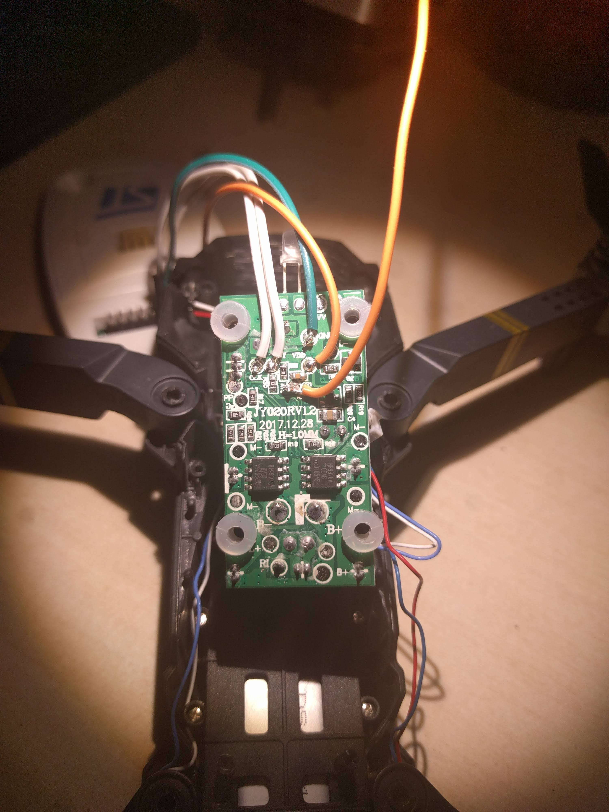

# Eachine E58

## Overview
The Eachine E58 has a control / motor driver PCB and a camera/wifi PCB.
The drone will function using the controller with only the control board.

## Control Board
The main MCU is a Panchip PAN159 ARM cortex M0 with integrated rf reciever. Panchip has a page with downloads [here](http://bbs.panchip.com/forum.php?mod=viewthread&tid=35&extra=page%3D1)
The PAN159 is based on the Nuvoton Mini58, and I believe it integrates a 2.4GHz XN297 transciever.

### Peripherals
[MCU Pin Mapping](PinMapping.md)
* Motor drivers - NP9926A dual mosfet x 2
* Gyro - I2C Addr 0x69 - seems to be an MPU-6050
* Pressure sensor - I2C Addr 0x77 possibly bmp280
* Crystal - 16MHz This seems to only be used for the RF transciever

### Debugging
The PAN159 supports SWD and there labeled test pads on the underside of the control board. Using [Nuvoton's opencd fork](https://github.com/OpenNuvoton/OpenOCD-Nuvoton), you are able to connect to the MCU using an ST-Link or other compatible debugger.
